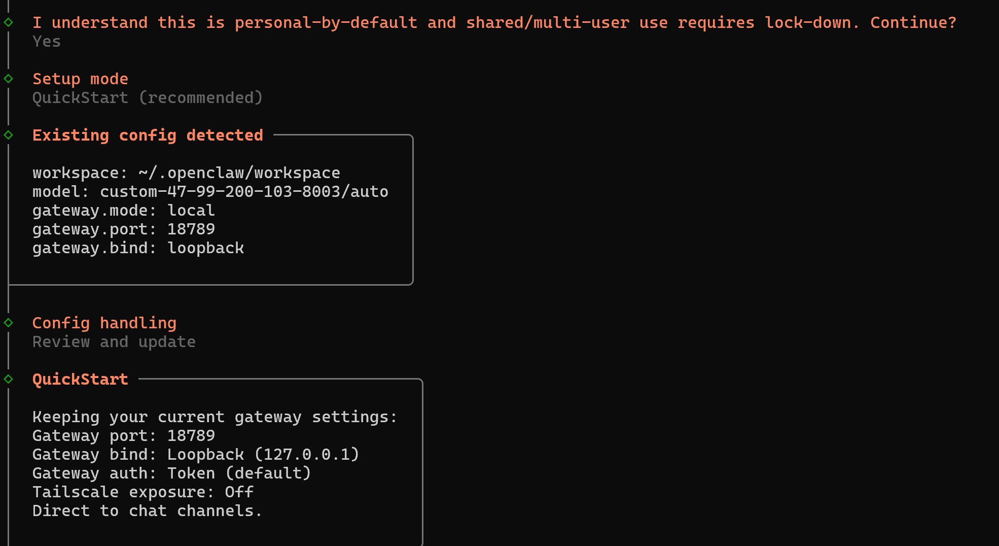
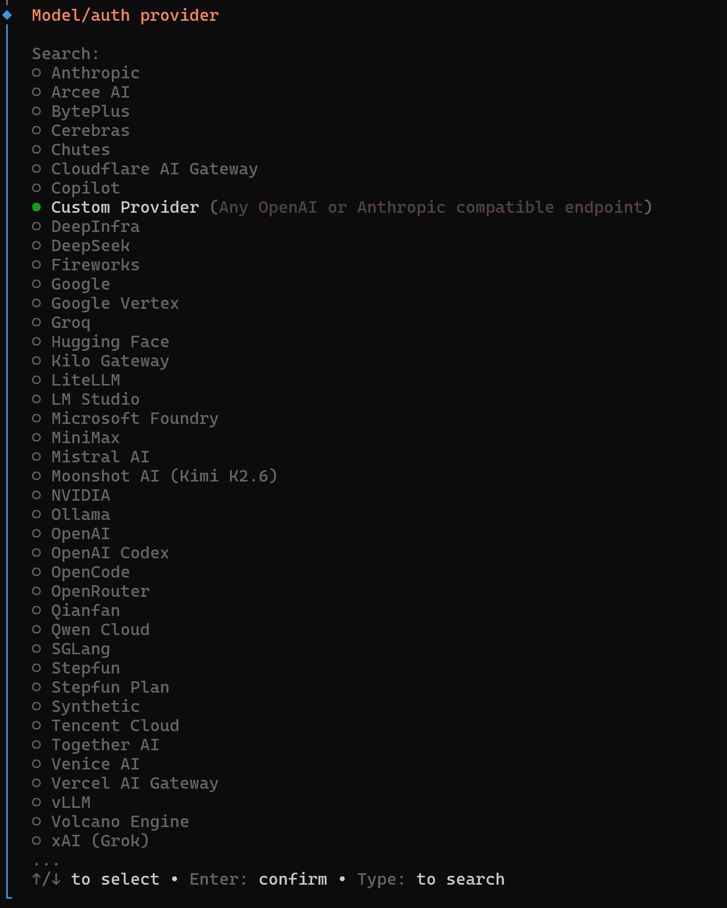
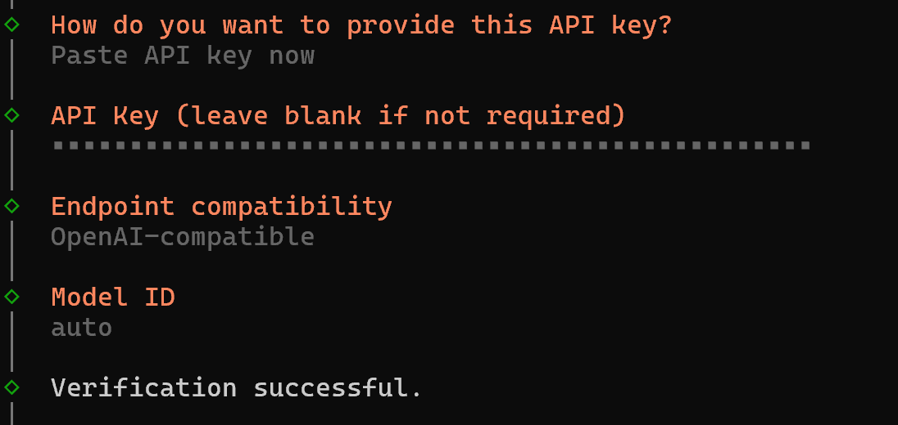

# OpenClaw TierFlow Setup

This guide shows how to connect TierFlow to OpenClaw.

Basic information:

| Item | Value |
|---|---|
| Base URL | `https://cn.tierflow.ai/v1` |
| Authentication | Bearer Token |
| Protocol | OpenAI API Compatible |
| Provider ID | `tierflow` |
| Model ID | `auto` |
| OpenClaw Model | `auto` |

OpenClaw will send requests to:

```text
POST https://cn.tierflow.ai/v1/chat/completions
```

## Method 1: Interactive Wizard

This is the recommended method for new users. Follow the terminal prompts step by step, then increase the context window after setup.

### 1. Open a Terminal

First confirm which terminal you are using.

If you are using a WSL Ubuntu terminal, run:

```bash
openclaw onboard --install-daemon
```

If you are using Windows PowerShell, but OpenClaw is installed inside WSL Ubuntu, run:

```powershell
wsl.exe -d Ubuntu bash -lc 'openclaw onboard --install-daemon'
```

If OpenClaw is installed directly on macOS or Linux, run:

```bash
openclaw onboard --install-daemon
```

If OpenClaw is installed directly on Windows, run:

```powershell
openclaw onboard --install-daemon
```

### 2. Confirm the Basic Setup

The wizard will ask a few basic questions first.



Choose:

```text
I understand this is personal-by-default and shared/multi-user use requires lock-down. Continue? -> Yes
Onboarding mode -> QuickStart
Config handling -> Review and update
```

If this is your first installation and there is no existing config, continue with the recommended defaults.

### 3. Select the Model Provider



For the model or authentication provider, select:

```text
Model/auth provider -> Custom Provider
```

Some versions may show:

```text
Custom Provider (Any OpenAI or Anthropic compatible endpoint)
```

Select the Custom Provider option.

### 4. Enter the Custom API Information



Fill in:

```text
Model/auth provider -> Custom Provider
API Base URL -> https://cn.tierflow.ai/v1
How do you want to provide this API key? -> Paste API key now
API Key -> your API key
Endpoint compatibility -> OpenAI-compatible
Model ID -> auto
Verification successful.
```

Use this fixed Model ID:

```text
auto
```

If the wizard asks for `Endpoint ID`, keep the default value generated by the wizard. No extra setup is required.

If the wizard asks for input capability, select:

```text
Input capability -> text
```

If it asks whether image input is supported, select:

```text
Image input -> No
```

### 5. Finish the Remaining Setup

```text
Select channel -> Choose the channel you need
Configure skills -> Install the skills you need
Complete Setup -> Finish setup
```

### 6. Test the Bot

```text
How do you want to hatch your bot? -> You can chat with the bot in TUI or Web UI
```

TUI:

```bash
openclaw tui
```

If the conversation works, the configuration is successful.

### 7. Reconfigure the Model Only

If OpenClaw is already installed and you only want to reconfigure the model, you do not need to run the full onboarding flow.

WSL Ubuntu / Linux / macOS:

```bash
openclaw configure --section model
```

Windows PowerShell calling WSL:

```powershell
wsl.exe -d Ubuntu bash -lc 'openclaw configure --section model'
```

Native Windows installation:

```powershell
openclaw configure --section model
```

Then continue from the provider selection step.

### 8. Increase the Context Window

The wizard may write a conservative context size for custom models. This API is a model router, so use:

```text
contextWindow: 1000000
maxTokens: 128000
```

WSL Ubuntu terminal / Linux / macOS:

```bash
cat <<'JSON' | openclaw config patch --stdin
{
  "models": {
    "providers": {
      "tierflow": {
        "models": [
          {
            "id": "auto",
            "name": "auto",
            "reasoning": false,
            "input": ["text"],
            "cost": {
              "input": 0,
              "output": 0,
              "cacheRead": 0,
              "cacheWrite": 0
            },
            "contextWindow": 1000000,
            "maxTokens": 128000,
            "api": "openai-completions"
          }
        ]
      }
    }
  }
}
JSON
```

Windows PowerShell calling WSL:

```powershell
$patch = @'
{
  "models": {
    "providers": {
      "tierflow": {
        "models": [
          {
            "id": "auto",
            "name": "auto",
            "reasoning": false,
            "input": ["text"],
            "cost": {
              "input": 0,
              "output": 0,
              "cacheRead": 0,
              "cacheWrite": 0
            },
            "contextWindow": 1000000,
            "maxTokens": 128000,
            "api": "openai-completions"
          }
        ]
      }
    }
  }
}
'@

$b64 = [Convert]::ToBase64String([Text.Encoding]::UTF8.GetBytes($patch))
wsl.exe -d Ubuntu bash -lc "echo $b64 | base64 -d | openclaw config patch --stdin"
```

Native Windows installation:

Use the same `$patch = @' ... '@` content above, then run:

```powershell
$patch | openclaw config patch --stdin
```

### 9. Restart the Gateway

WSL Ubuntu / Linux / macOS:

```bash
openclaw gateway restart
```

Windows PowerShell calling WSL:

```powershell
wsl.exe -d Ubuntu bash -lc 'openclaw gateway restart'
```

Native Windows installation:

```powershell
openclaw gateway restart
```

## Method 2: Edit the Config Manually

Use this method if you prefer editing `openclaw.json` yourself.

### 1. Find the Config File

WSL Ubuntu / Linux / macOS:

```bash
openclaw config file
```

Windows PowerShell calling WSL:

```powershell
wsl.exe -d Ubuntu bash -lc 'openclaw config file'
```

Native Windows installation:

```powershell
openclaw config file
```

The path is usually:

```text
~/.openclaw/openclaw.json
```

### 2. Merge This Config

Merge the following content into `openclaw.json`. If the file already contains `models` or `agents.defaults.models`, keep the existing content and only add this provider and model entry.

```json
{
  "models": {
    "mode": "merge",
    "providers": {
      "tierflow": {
        "baseUrl": "https://cn.tierflow.ai/v1",
        "apiKey": "YOUR_API_KEY_HERE",
        "api": "openai-completions",
        "models": [
          {
            "id": "auto",
            "name": "auto",
            "reasoning": false,
            "input": ["text"],
            "cost": {
              "input": 0,
              "output": 0,
              "cacheRead": 0,
              "cacheWrite": 0
            },
            "contextWindow": 1000000,
            "maxTokens": 128000,
            "api": "openai-completions"
          }
        ]
      }
    }
  },
  "agents": {
    "defaults": {
      "model": {
        "primary": "auto"
      },
      "models": {
        "auto": {}
      }
    }
  }
}
```

### 3. Validate and Restart

WSL Ubuntu / Linux / macOS:

```bash
openclaw config validate
openclaw gateway restart
```

Windows PowerShell calling WSL:

```powershell
wsl.exe -d Ubuntu bash -lc 'openclaw config validate && openclaw gateway restart'
```

Native Windows installation:

```powershell
openclaw config validate
openclaw gateway restart
```

## Method 3: Optional Command Write

Use this only if you already understand the config and want to write it quickly. New users should use the interactive wizard or manual editing method first.

### WSL Ubuntu Terminal / Linux / macOS

Replace `YOUR_API_KEY_HERE` with your API key:

```bash
cat <<'JSON' | openclaw config patch --stdin
{
  "models": {
    "mode": "merge",
    "providers": {
      "tierflow": {
        "baseUrl": "https://cn.tierflow.ai/v1",
        "apiKey": "YOUR_API_KEY_HERE",
        "api": "openai-completions",
        "models": [
          {
            "id": "auto",
            "name": "auto",
            "reasoning": false,
            "input": ["text"],
            "cost": {
              "input": 0,
              "output": 0,
              "cacheRead": 0,
              "cacheWrite": 0
            },
            "contextWindow": 1000000,
            "maxTokens": 128000,
            "api": "openai-completions"
          }
        ]
      }
    }
  },
  "agents": {
    "defaults": {
      "model": {
        "primary": "auto"
      },
      "models": {
        "auto": {}
      }
    }
  }
}
JSON

openclaw gateway restart
```

### Windows PowerShell Calling WSL

Replace `YOUR_API_KEY_HERE` with your API key:

```powershell
$patch = @'
{
  "models": {
    "mode": "merge",
    "providers": {
      "tierflow": {
        "baseUrl": "https://cn.tierflow.ai/v1",
        "apiKey": "YOUR_API_KEY_HERE",
        "api": "openai-completions",
        "models": [
          {
            "id": "auto",
            "name": "auto",
            "reasoning": false,
            "input": ["text"],
            "cost": {
              "input": 0,
              "output": 0,
              "cacheRead": 0,
              "cacheWrite": 0
            },
            "contextWindow": 1000000,
            "maxTokens": 128000,
            "api": "openai-completions"
          }
        ]
      }
    }
  },
  "agents": {
    "defaults": {
      "model": {
        "primary": "auto"
      },
      "models": {
        "auto": {}
      }
    }
  }
}
'@

$b64 = [Convert]::ToBase64String([Text.Encoding]::UTF8.GetBytes($patch))
wsl.exe -d Ubuntu bash -lc "echo $b64 | base64 -d | openclaw config patch --stdin && openclaw gateway restart"
```

### Native Windows Installation

Replace `YOUR_API_KEY_HERE` with your API key:

```powershell
$patch = @'
{
  "models": {
    "mode": "merge",
    "providers": {
      "tierflow": {
        "baseUrl": "https://cn.tierflow.ai/v1",
        "apiKey": "YOUR_API_KEY_HERE",
        "api": "openai-completions",
        "models": [
          {
            "id": "auto",
            "name": "auto",
            "reasoning": false,
            "input": ["text"],
            "cost": {
              "input": 0,
              "output": 0,
              "cacheRead": 0,
              "cacheWrite": 0
            },
            "contextWindow": 1000000,
            "maxTokens": 128000,
            "api": "openai-completions"
          }
        ]
      }
    }
  },
  "agents": {
    "defaults": {
      "model": {
        "primary": "auto"
      },
      "models": {
        "auto": {}
      }
    }
  }
}
'@

$patch | openclaw config patch --stdin
openclaw gateway restart
```

## Verify the Setup

Check the default model:

WSL Ubuntu / Linux / macOS:

```bash
openclaw models status --plain
```

Windows PowerShell calling WSL:

```powershell
wsl.exe -d Ubuntu bash -lc 'openclaw models status --plain'
```

Native Windows installation:

```powershell
openclaw models status --plain
```

You should see:

```text
auto
```

Test the model:

WSL Ubuntu / Linux / macOS:

```bash
openclaw infer model run --local --model auto --prompt "Reply exactly OK."
```

Windows PowerShell calling WSL:

```powershell
wsl.exe -d Ubuntu bash -lc 'openclaw infer model run --local --model auto --prompt "Reply exactly OK."'
```

Native Windows installation:

```powershell
openclaw infer model run --local --model auto --prompt "Reply exactly OK."
```

Open the Dashboard:

```text
http://127.0.0.1:18789/
```

In the model dropdown, choose:

```text
Default (auto)
```

or:

```text
auto
```

## Notes

The TierFlow is backed by a model router, so OpenClaw only needs one `auto` model. The actual backend model, such as `step3.5-flash`, `deepseek-v4-flash`, or `gpt-oss`, is selected by the service.
