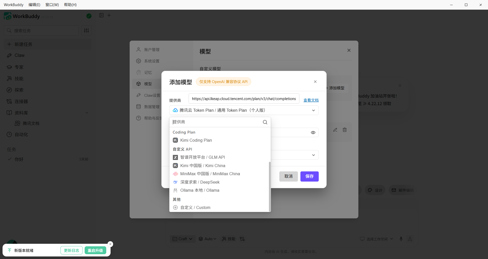

# WorkBuddy TierFlow Setup

This guide explains how to connect WorkBuddy to TierFlow.

Basic info:

| Item | Value |
|---|---|
| Base URL | `https://cn.tierflow.ai` |
| Auth | Bearer Token |
| Protocol | Anthropic API |
| Model | `auto` |

## 1. Download WorkBuddy

Go to the [WorkBuddy](https://copilot.tencent.com/work/) official page, download the version for your operating system, and complete the installation.

## 2. Configure TierFlow

Open WorkBuddy, click the model button in the chat box, then click "Configure Custom Model" at the bottom.

In the provider dropdown, scroll to the bottom and click "Custom".

Fill in the API URL and API KEY from the console (OpenAI-compatible format URL and your key). Set the model name to `auto`.

Leave other settings as default. Click confirm to start using TierFlow in WorkBuddy.
