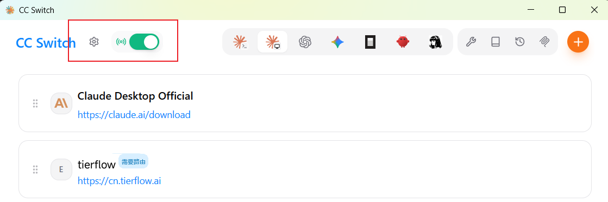
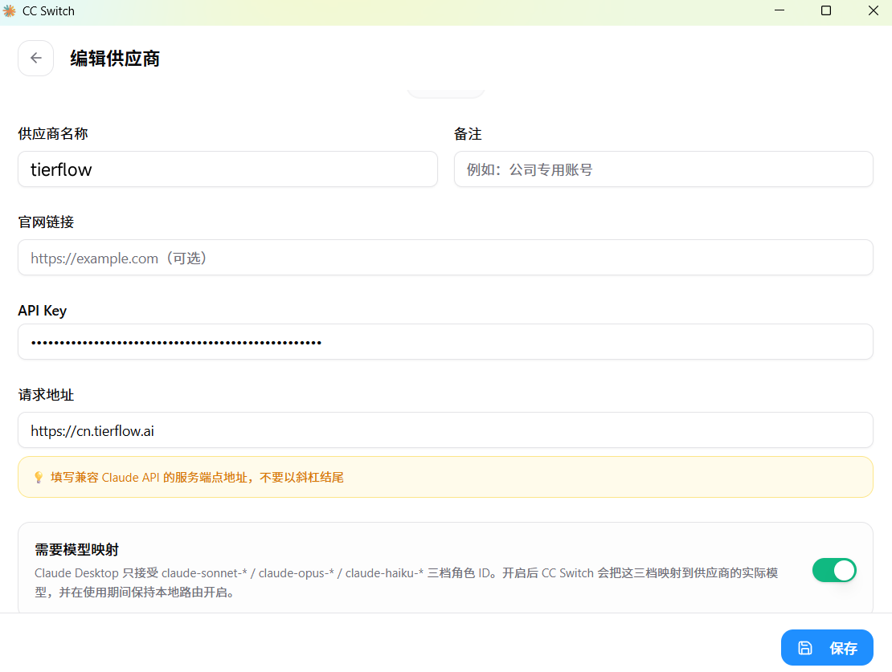
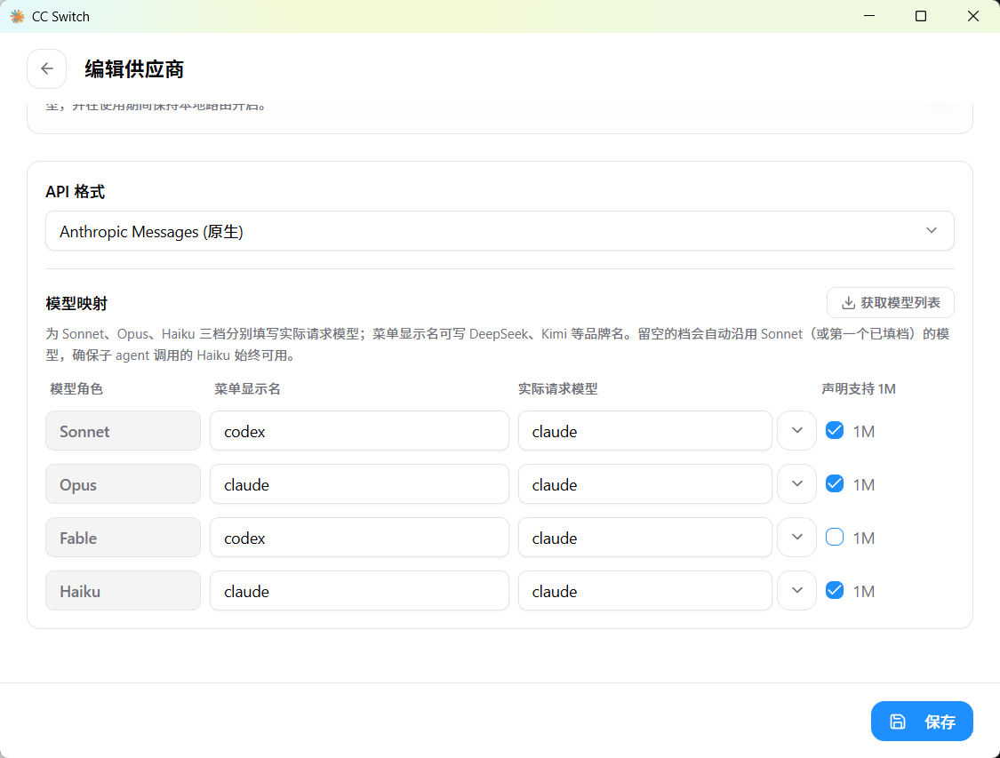
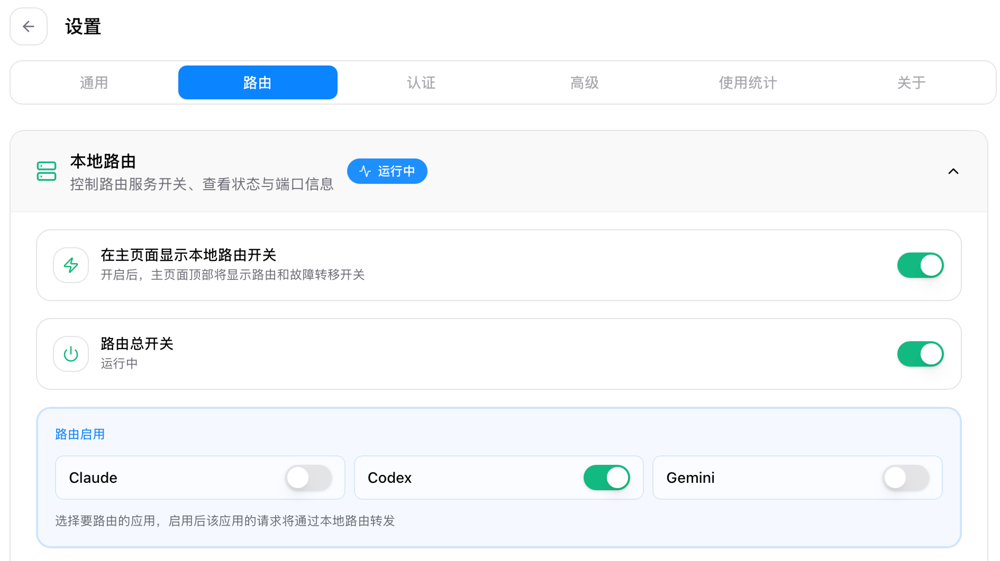
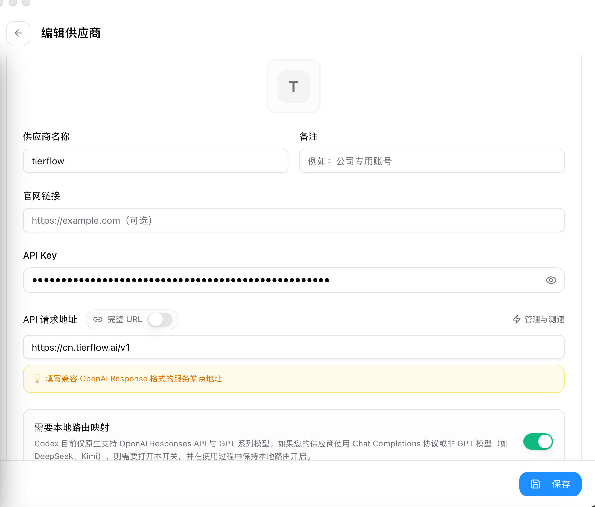
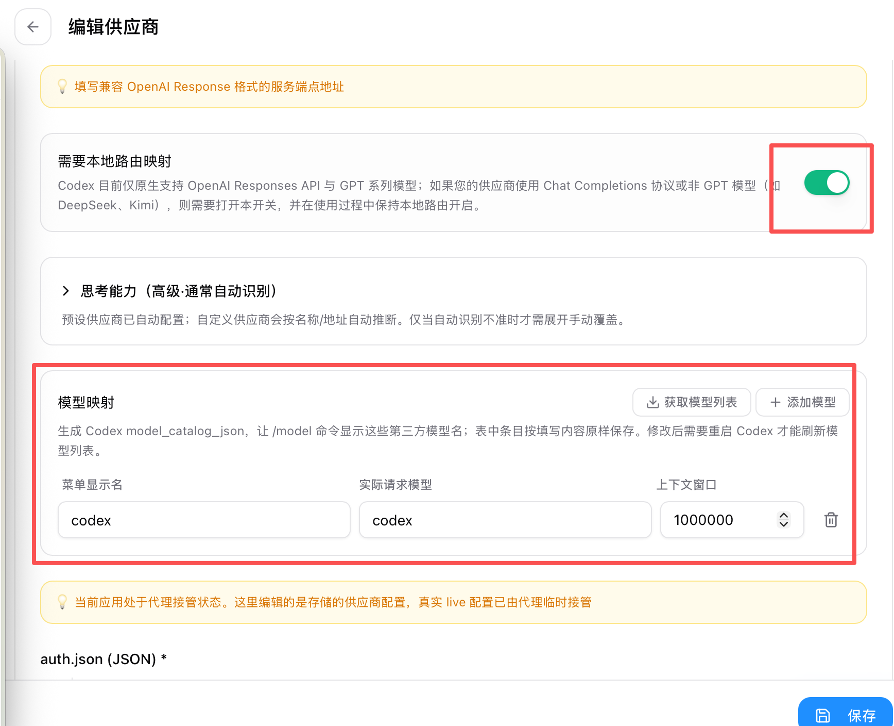

# CC Switch 接入 TierFlow 教程

本文介绍如何通过 CC Switch 统一管理 Claude Code 和 Codex 的 TierFlow 配置。

CC Switch 是一个跨平台桌面工具，可以集中管理 Claude Code、Codex、OpenCode、OpenClaw、Gemini CLI 等 AI 编程工具的供应商配置。使用 CC Switch 后，你可以在图形界面中切换供应商，避免手动反复修改 `settings.json`、`auth.json` 和 `config.toml`。

基础信息：

| 工具 | 协议 | Base URL | Model |
|---|---|---|---|
| Claude Code | Anthropic API Compatible | `https://cn.tierflow.ai` | `claude` |
| Codex | OpenAI API | `https://cn.tierflow.ai/v1` | `codex` |

::: tip
TierFlow 已分别兼容 Anthropic API 和 OpenAI API。本教程的 Claude 与 Codex 桌面配置通过 CC Switch 本地路由接管请求，因此需要按下文打开本地路由和模型映射。
:::

## 1. 安装前准备

确认已经安装 Node.js 18 LTS 或更高版本：

```bash
node --version
npm --version
```

确认需要托管的 CLI 已安装。

Claude Code：

```bash
claude --version
```

如果未安装，可以使用：

```bash
npm install -g @anthropic-ai/claude-code
# 或 macOS
brew install claude-code
```

Codex：

```bash
codex --version
```

如果未安装，可以使用：

```bash
npm install -g @openai/codex
# 或 macOS
brew install codex
```

## 2. 安装 CC Switch

请只从以下官方渠道获取 CC Switch：

- [CC Switch 官网](https://ccswitch.io/)
- [GitHub Releases](https://github.com/farion1231/cc-switch/releases)
- [GitHub 源码仓库](https://github.com/farion1231/cc-switch)

### Windows

1. 打开 [GitHub Releases](https://github.com/farion1231/cc-switch/releases)。
2. 下载 `CC-Switch-v{版本号}-Windows.msi`。
3. 双击安装包，按提示完成安装。

也可以下载 `CC-Switch-v{版本号}-Windows-Portable.zip`，解压后运行 `CC-Switch.exe`。

### macOS

推荐使用 Homebrew：

```bash
brew tap farion1231/ccswitch
brew install --cask cc-switch
```

更新：

```bash
brew upgrade --cask cc-switch
```

也可以从 Releases 下载 `CC-Switch-v{版本号}-macOS.dmg`，打开后拖入「应用程序」。

### Linux

Debian / Ubuntu：

```bash
sudo dpkg -i CC-Switch-v{版本号}-Linux-*.deb
sudo apt-get install -f
```

Arch Linux：

```bash
paru -S cc-switch-bin
# 或
yay -S cc-switch-bin
```

通用 AppImage：

```bash
chmod +x CC-Switch-v{版本号}-Linux-*.AppImage
./CC-Switch-v{版本号}-Linux-*.AppImage
```

安装完成后启动 CC Switch。首次启动时，如果本机已经存在 Claude Code 或 Codex 配置，CC Switch 可能会自动导入为默认供应商。

<!-- 后续可补图：CC Switch 首次启动和应用切换器截图。 -->

## 3. 配置 Claude Code

::: warning
如果使用 Claude Code 桌面版，请下载较新版本的 CC Switch。旧版本可能没有 Claude Desktop / Claude Code 桌面版的本地路由支持，或无法显示下面的路由与模型映射选项。
:::

1. 打开 CC Switch。
2. 确认顶部本地路由开关已打开，并且 Claude 供应商卡片上显示「需要路由」。



3. 在顶部或应用切换器中选择 `Claude Code` 或 Claude Desktop 对应的应用。
4. 点击右上角 `+`，添加供应商。
5. 选择 `自定义`，进入供应商编辑页。
6. 按下面内容填写基础信息：

| 项目 | 填写内容 |
|---|---|
| 供应商名称 | `tierflow` |
| 官网链接 | 可留空 |
| API Key | 你的 TierFlow API Key |
| 请求地址 | `https://cn.tierflow.ai` |



API Key 请填写真实的 TierFlow API Key。

7. 打开「需要模型映射」开关。
8. API 格式选择 `Anthropic Messages（原生）`。
9. 在「模型映射」中配置常用角色：

| 模型角色 | 菜单显示名 | 实际请求模型 | 声明支持 1M |
|---|---|---|---|
| Sonnet | `codex` | `claude` | 开启 |
| Opus | `claude` | `claude` | 开启 |
| Fable | `codex` | `claude` | 可关闭 |
| Haiku | `claude` | `claude` | 开启 |



保存后回到 Claude 供应商列表，启用 `tierflow`。启用后，CC Switch 会把 Claude 请求转发到本地路由，再由本地路由转发到 TierFlow。

## 4. 配置 Codex

1. 打开 CC Switch。
2. 进入「设置」>「路由」，确认本地路由正在运行，并在「路由启用」中打开 `Codex`。



3. 回到应用切换器，选择 `Codex`。
4. 点击右上角 `+`，添加供应商。
5. 选择 `自定义`，进入供应商编辑页。
6. 按下面内容填写基础信息：

| 项目 | 填写内容 |
|---|---|
| 供应商名称 | `tierflow` |
| 官网链接 | 可留空 |
| API Key | 你的 TierFlow API Key |
| API 请求地址 | `https://cn.tierflow.ai/v1` |



7. 打开「需要本地路由映射」开关。
8. 在「模型映射」中添加一条模型：

| 菜单显示名 | 实际请求模型 | 上下文窗口 |
|---|---|---|
| `codex` | `codex` | `1000000` |



9. Codex 配置使用下面两段内容。

`auth.json`：

```json
{
  "OPENAI_API_KEY": "YOUR_API_KEY_HERE"
}
```

`config.toml`：

```toml
model_provider = "tierflow"
model = "codex"
disable_response_storage = true
preferred_auth_method = "apikey"

[model_providers.tierflow]
name = "tierflow"
base_url = "https://cn.tierflow.ai/v1"
wire_api = "responses"
```

把 `YOUR_API_KEY_HERE` 替换为你的 TierFlow API Key。

保存后回到 Codex 供应商列表，启用 `tierflow`。启用后，CC Switch 会写入 Codex 的配置文件。

| 系统 | auth.json | config.toml |
|---|---|---|
| Windows | `C:\Users\你的用户名\.codex\auth.json` | `C:\Users\你的用户名\.codex\config.toml` |
| macOS | `/Users/你的用户名/.codex/auth.json` | `/Users/你的用户名/.codex/config.toml` |
| Linux | `/home/你的用户名/.codex/auth.json` | `/home/你的用户名/.codex/config.toml` |

本地路由映射需要在使用过程中保持开启。修改模型映射后，重启 Codex 才能刷新 `/model` 命令中显示的模型列表。

## 5. 验证配置

### Claude Code

关闭当前终端，重新打开后进入任意项目目录：

```bash
cd your-project-folder
claude
```

在 Claude Code 中输入：

```text
/status
```

确认模型为 `claude`，然后测试：

```text
Reply exactly OK.
```

能正常返回内容即配置成功。

### Codex

关闭当前终端，重新打开后进入任意项目目录：

```bash
cd your-project-folder
codex
```

发送一条简单测试消息：

```text
Reply exactly OK.
```

能正常返回内容即配置成功。

## 6. 常见问题

### 切换供应商后没有生效

先重启正在使用的终端、VS Code、Cursor 或 Windows Terminal。Codex 和 Claude Code 可能在启动时读取配置，已打开的会话不一定会重新加载最新配置。

### Claude Code 仍然走官方 Claude

检查 CC Switch 顶部本地路由开关是否已打开，并确认 Claude 供应商列表中启用的是 `tierflow`。如果使用 Claude Code 桌面版，还需要确认 CC Switch 是较新版本，且 Claude 应用卡片显示「需要路由」。

如果系统环境变量里写过旧的 `ANTHROPIC_BASE_URL` 或 `ANTHROPIC_AUTH_TOKEN`，建议删除旧值后重新打开终端或 Claude Code 桌面版。

### Codex 仍然走官方 OpenAI

检查 CC Switch 当前启用的供应商是否是 `tierflow`，并确认 `config.toml` 中存在：

```toml
model_provider = "tierflow"
base_url = "https://cn.tierflow.ai/v1"
```

同时确认 `auth.json` 中的 `OPENAI_API_KEY` 已替换为真实 TierFlow API Key。

### 认证失败

检查 API Key 是否复制完整，且没有多余空格。Claude 和 Codex 都在 CC Switch 的供应商编辑页填写 API Key；如果同时手动维护配置文件，不要把 Claude 的 `ANTHROPIC_AUTH_TOKEN` 和 Codex 的 `OPENAI_API_KEY` 混用。

### 什么时候需要本地路由映射

Claude 和 Codex 的桌面配置都需要开启本地路由。Claude 需要本地路由来接管桌面版请求并完成模型角色映射；Codex 需要本地路由映射来生成模型列表并把请求转发到 `https://cn.tierflow.ai/v1`。
