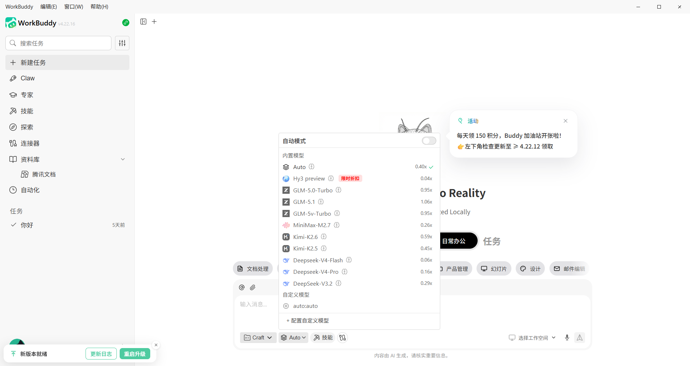

# WorkBuddy 接入 TierFlow 教程

本文介绍如何把 WorkBuddy 接入 TierFlow。

基础信息：

| 项目 | 值 |
|---|---|
| Base URL | `https://api.tierflow.ai/anthropic` |
| 认证方式 | Bearer Token |
| 兼容协议 | Anthropic API |
| Model | `auto` |

## 1. 下载 WorkBuddy

前往 [WorkBuddy](https://copilot.tencent.com/work/) 官方页面下载与个人电脑系统对应的版本，并完成安装。

## 2. 配置TierFlow

进入 WorkBuddy 后，点击聊天框中的模型按钮，点击底部配置自定义模型。

在提供商下拉栏中滑动到底部，点击自定义。

接口地址和 API KEY分别填写控制台中的 OpenAI 兼容格式 URL 和自己的 KEY，模型名称填写auto。

其他内容保持默认即可。配置完毕点击确认即可在 WorkBuddy 中使用 TierFlow。
